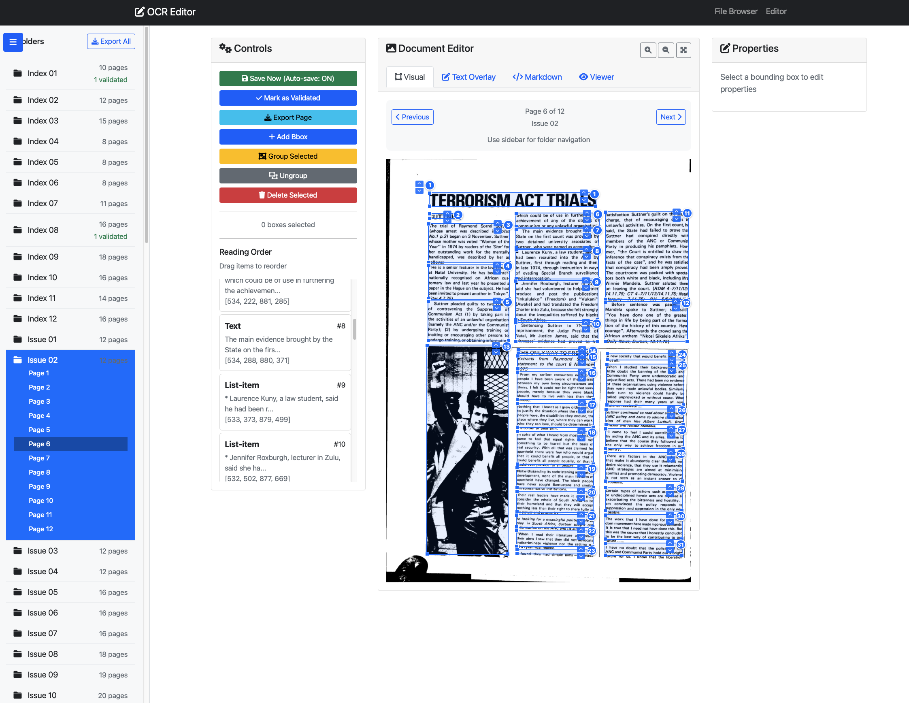

# OCR Editor

A Flask web application for editing OCR output, allowing users to:
- Rearrange reading order of text blocks
- Edit text content
- Adjust bounding boxes interactively
- Group bounding boxes together
- Change layout categories



## Features

### File Loading & Organization
- **Organized File Browser**: Files grouped alphabetically by folder with page counts
- **PDF Page Support**: Automatic detection and sorting of multi-page documents
- **Validation Status**: Visual indicators show which pages have been validated
- Load files from configured data directory (via `config.yaml`)
- Drag-and-drop upload of JSON and image files
- Support for various image formats (PNG, JPG, JPEG)

### Data Management
- **SQLite Database**: All edits automatically saved to local database
- **Validation Tracking**: Mark pages as validated with timestamp logging
- **Export Options**: 
  - Single page export with metadata
  - Folder export (all pages in a document)
  - Entire project export
- **Project Statistics**: Real-time tracking of validation progress

### Interactive Editing
- **Bounding Box Editing**: Click and drag to move boxes, resize using corner handles
- **Text Editing**: Edit text content in the properties panel
- **Category Selection**: Change layout categories from dropdown
- **Reading Order**: Drag items in the list to reorder reading sequence
- **Grouping**: Select multiple boxes and group them together
- **Zoom Controls**: Zoom in/out for precise editing
- **Page Navigation**: Navigate between PDF pages with Previous/Next buttons
- **Quick Jump**: Jump directly to any page number
- **Validation Tracking**: Mark pages as validated with visual indicators
- **Database Storage**: All edits saved to local SQLite database
- **Export Functionality**: Export individual pages, folders, or entire project
- **Project Statistics**: Track validation progress across all pages
- **Keyboard Shortcuts**: Use arrow keys for navigation, Ctrl+S to save

### Layout Categories
Supports all standard layout categories:
- Caption
- Footnote  
- Formula
- List-item
- Page-footer
- Page-header
- Picture
- Section-header
- Table
- Text
- Title

## Installation

1. Install dependencies:
```bash
pip install -r requirements.txt
```

2. Configure data directory in `config.yaml`:
```yaml
data_dir: /path/to/your/ocr/output
```

3. Run the application:
```bash
python app.py
```

4. Open your browser to `http://localhost:5000`

## Usage

### Loading Files
1. **From Data Directory**: Browse available files on the home page
2. **Upload**: Drag and drop or select JSON and image files

### Editing Workflow
1. Select bounding boxes by clicking (Ctrl/Cmd+click for multiple selection)
2. Edit properties in the right panel:
   - Change category
   - Edit text content
   - Adjust coordinates manually
3. Move and resize boxes directly on the image
4. Reorder reading sequence by dragging in the left panel
5. Group related boxes using the Group button
6. Save changes when done

### Keyboard Shortcuts
- **Ctrl/Cmd+Click**: Multi-select bounding boxes
- **Click outside**: Deselect all boxes

## Data Format

The application expects JSON files with the following format:

```json
[
  {
    "bbox": [x1, y1, x2, y2],
    "category": "Text",
    "text": "Sample text content"
  }
]
```

Where:
- `bbox`: Bounding box coordinates [x1, y1, x2, y2]
- `category`: Layout category (see supported categories above)
- `text`: Text content (optional for non-text elements)

## File Structure

```
dots-ocr-editor/
├── app.py              # Main Flask application
├── config.yaml         # Configuration file
├── requirements.txt    # Python dependencies
├── templates/          # HTML templates
│   ├── base.html      # Base template
│   ├── index.html     # File browser
│   └── editor.html    # Main editor interface
├── uploads/            # Uploaded files directory
└── assets/             # Example files
```

## Development

The application uses:
- **Flask**: Web framework
- **Bootstrap 5**: UI styling
- **jQuery**: DOM manipulation
- **SortableJS**: Drag-and-drop functionality
- **Font Awesome**: Icons

To run in development mode:
```bash
python app.py
```

The application will be available at `http://localhost:5000` with debug mode enabled.

https://drive.google.com/file/d/1hgu4JCBSYrqcS4E-PVd8tqKx9-OdtDL7/view?usp=share_link